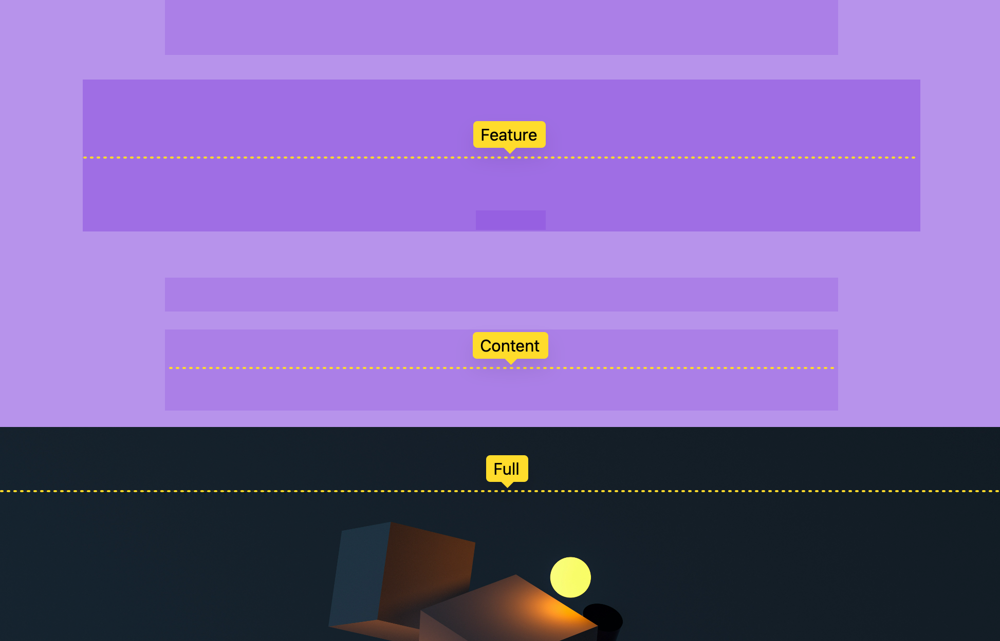
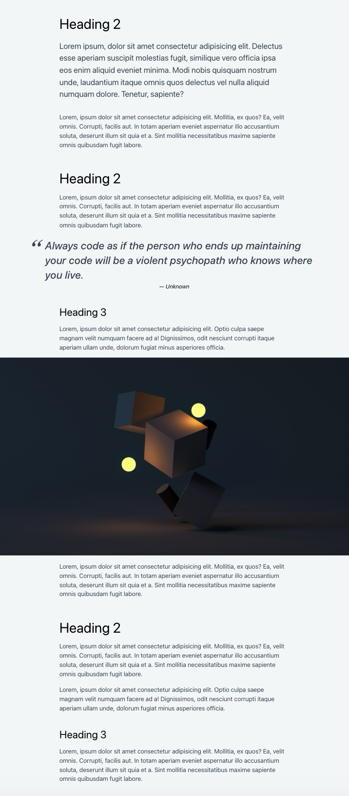

# **Grid Breakout**

## Formål

At lave et layout, der gør det muligt at lave 'breakouts' - elementer, der bryder ud af sidens maksimumbredde for at skabe et dynamisk layout.

## Ressourcer

- [Layout breakouts teknik](https://ryanmulligan.dev/blog/layout-breakouts/)

## Opgavebeskrivelse

Du skal arbejde med denne branch, som indeholder et HTML-dokuement med overskrifter, paragraffer, et citat og et billede. Din opgave er at anvende CSS Grid, i stedet for den teknik, der er anvendt i `style.css`, til at lave et fleksibelt breakout-layout, hvor elementer som citatblokke og billeder strækker sig ud over deres sædvanlige containerbredde.

Du skal navngive dine grid-linjer, så du nemmere kan placere diverse elementer i grid'et (se teknikken under "Ressourcer").

Citatblokken skal udvide sig ud over den normale indholdskolonne – du bestemmer selv, hvor meget.

Billeder skal fylde viewportens bredde.

### Specifikke mål

- Forstå, hvordan CSS Grid hælper med at lave fleksible layouts.
- Arbejde med og ændre eksisterende CSS

> [!NOTE]  
> **Bemærk, at denne branch allerede inkluderer et CSS Reset.**

## Aflevering

Find linket til din løsning på Netlify og aflever det på Fronter.

Link-struktur: **breakout--**[Dit unikke netlify link].netlify.app/

