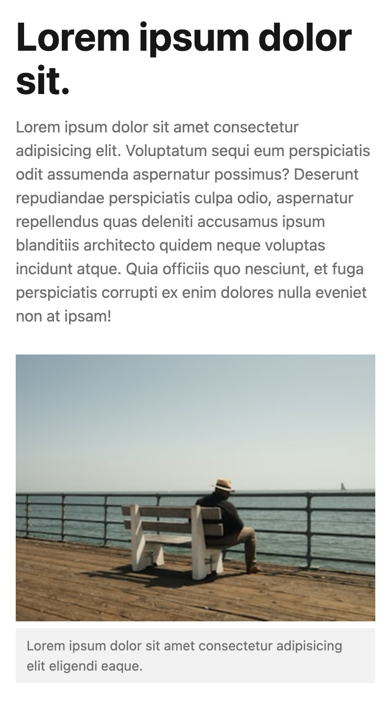

# **Subgrid Caption**

## Formål

Formålet med denne opgave er at anvende CSS Subgrid til at få "børnebørn" til at deltage i et overordnet grid.

## Ressourcer

- [Subgrid Øvelser](https://exercssises.vercel.app/subgrid)

## Opgavebeskrivelse

Du skal arbejde med denne branch, som indeholder et HTML-dokument med en billedsektion samt et stylesheet med tilhørende styles. Din opgave er at anvende CSS Grid og Subgrid til at placere tekstindholdet og billedteksten, så de flugter.

Du skal implementere Subgrid på `figure`-elementet, så dets børnebørn (img og figcaption) arver grid-strukturen fra forælderen.

Bemærk, at det kan være nødvendigt at placere elementerne eksplicit i grid'et (altså både `grid-column` og `grid-row`).

Du skal også sikre, at layoutet er responsivt, således at for mindre skærme (under `600px`) justeres layoutet til at være stakket vertikalt.

### Specifikke mål

- Forstå, hvordan CSS Subgrid kan bruges til at opnå præcis kontrol over layout af nested elementer.
- Arbejde med og ændre eksisterende CSS

> [!NOTE]  
> **Bemærk, at denne branch allerede inkluderer et CSS Reset.**

## Aflevering

Find linket til din løsning på Netlify og aflever det på Fronter.

Link-struktur: **subgrid-caption--**[Dit unikke netlify link].netlify.app/
