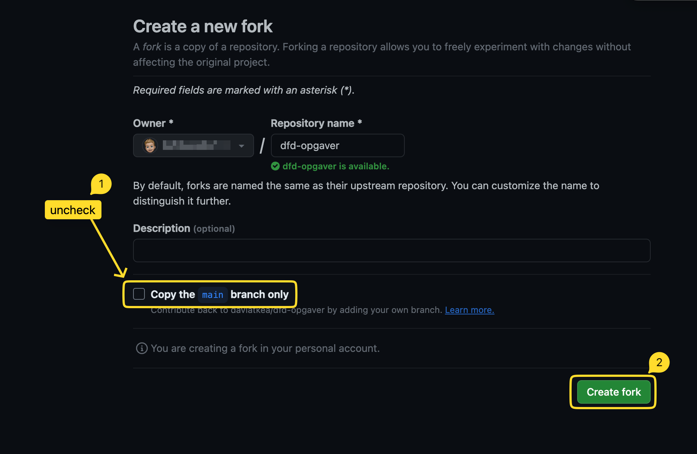
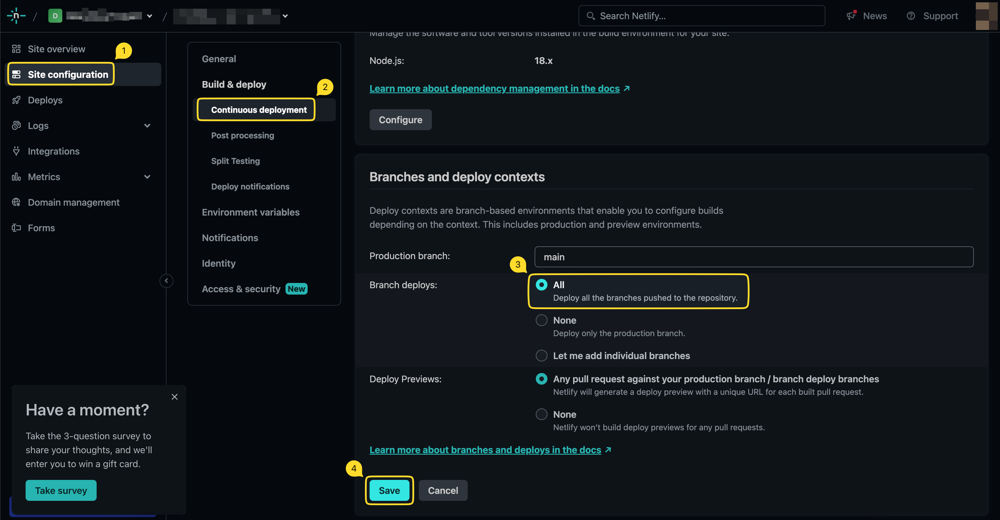

# Frontend Design - Opgaver

> [!IMPORTANT]  
> Følg instruktionerne, før du kloner.

## Instruktioner

1. Fork alle branches (fold ud for at se hvordan)

2. Klon det forkede repository

3. Forbind med Netlify og sørg for, at deployment sker fra alle branches (fold ud for at se mere)

4. Vælg en øvelse ved at skifte til den relevante branch (se liste over øvelser nedenfor)

## Opgaveoversigt (via branches)

### Typografi

- Flow Space-teknikken ("flow-space")
- Styling af tekstindhold ("text-styling")

### Selectors

- No Classes ("no-classes")

### Layout

- Grid Breakout ("breakout")
- Scrolling Container ("scrolling-container")
- Subgrid Caption ("subgrid-caption")
- Subgrid Card ("subgrid-card")

### UI Patterns

- Card UI ("card-ui")

### Code in the Dark

- Code in the Dark 1 ("citd-1")
- Code in the Dark 2 ("citd-2")

### Challenges

- Card Expand ("card-expand")
- Sticky Labels ("sticky-labels")

## Ressourcer

- [CSS Reset](/resources/reset.css)
- [CSS Patterns](/resources/patterns.md) (Opdateres løbende...)
- [CSS Anti-Patterns](/resources/anti-patterns.md) (Opdateres løbende...)
