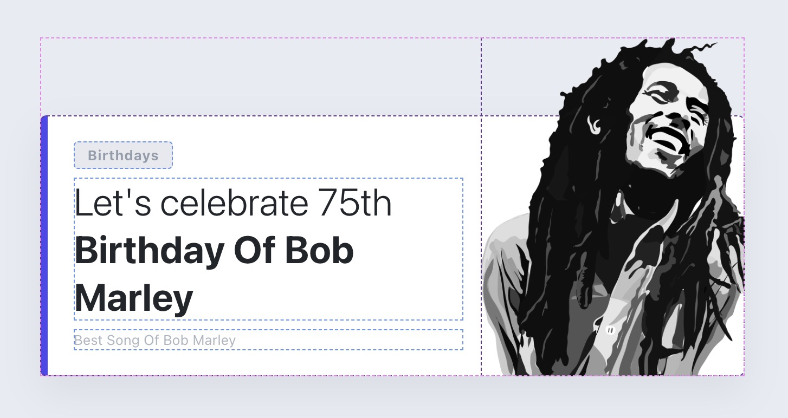
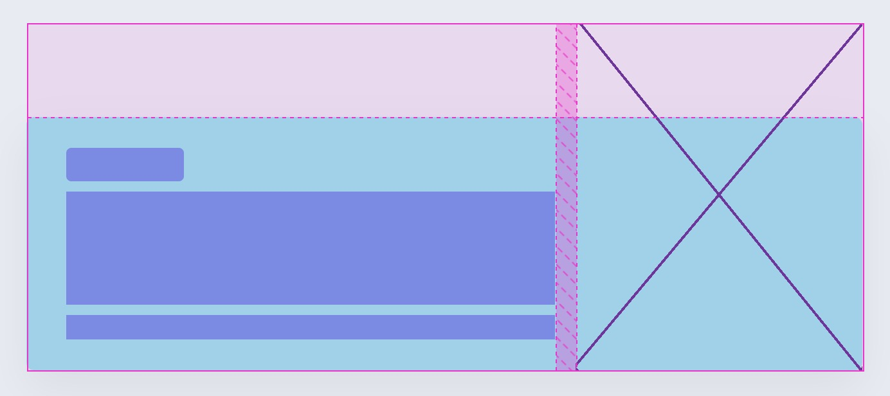

# **Subgrid card**

## Formål

At forstå og anvende CSS Subgrid til at skabe et card-layout, hvor visuelle elementer, såsom billeder, kan bryde ud af kortets traditionelle rammer for at skabe et mere dynamisk og engagerende design.

## Ressourcer

- [Subgrid Øvelser](https://exercssises.vercel.app/subgrid)

## Opgavebeskrivelse

Du skal arbejde med denne branch, som indeholder et HTML-dokument med et card-layout, der indeholder tekst og billede. Din opgave er at anvende CSS Subgrid til at organisere layoutet, så det bliver muligt at lade billedet bryde ud af kortets rammer.

Subgrid skal bruges til at definere layoutet, hvor under-elementer arver grid-strukturen fra deres overordnede container. Dette giver dig mulighed for mere præcist at kontrollere, hvordan elementer placeres i forhold til hinanden og i forhold til det overordnede layout.

### Specifikke mål

- Forstå, hvordan CSS Subgrid kan bruges til at opnå præcis kontrol over layout af nested elementer.
- Arbejde med og ændre eksisterende CSS

> [!NOTE]  
> **Bemærk, at denne branch allerede inkluderer et CSS Reset.**

## Aflevering

Find linket til din løsning på Netlify og aflever det på Fronter.

Link-struktur: **subgrid-card--**[Dit unikke netlify link].netlify.app/
