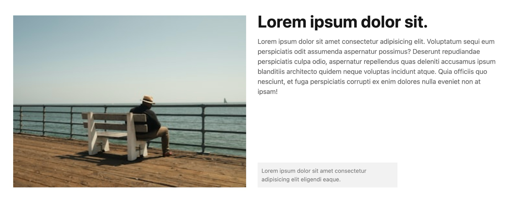
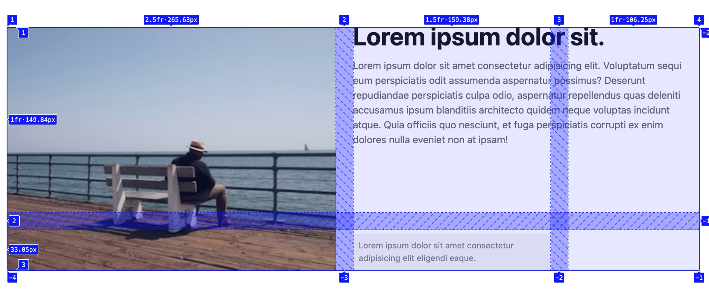
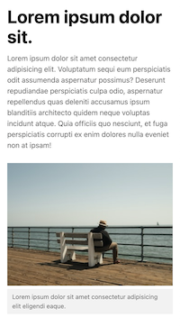

# **Subgrid Caption**

## Formål

Formålet med denne opgave er at anvende CSS Subgrid til at få "børnebørn" til at deltage i et overordnet grid.

## Ressourcer

- [Subgrid øvelser](https://exercssises.vercel.app/subgrid)

## Opgavebeskrivelse

Du skal arbejde med denne branch, som indeholder et HTML-dokument med en billedsektion samt et stylesheet med tilhørende styles. Din opgave er at anvende CSS Grid og Subgrid til at placere tekstindholdet og billedteksten, så de flugter med hindanden som på billedet nedenfor.

Du skal implementere Subgrid på `figure`-elementet for både rækkerne og kolonnerne, så dets børnebørn (`img` og `figcaption`) arver grid-strukturen fra forælderen.

Bemærk, at det kan være nødvendigt at placere elementerne eksplicit i grid'et (altså både `grid-column` og `grid-row`).

Du skal også sikre, at layoutet er responsivt, så det tilpasses mindre skærme (under `600px`) ved at ændre det til en enkelt kolonne.

### Specifikke mål

- Forstå, hvordan CSS Subgrid kan bruges til at opnå præcis kontrol over layout af nested elementer.
- Arbejde med og ændre eksisterende CSS

> [!NOTE]  
> **Bemærk, at denne branch allerede inkluderer et CSS Reset.**

## Ekstra udfordring (valgfri)

Navngiv grid-linjerne for at gøre placeringen af diverse elementer nemmere. På den måde kan du referere til linjerne ved navn i stedet for tal. Fx `.content { grid-area: content; }` og `figcaption { grid-area: caption; }`.

Lær mere om det på [MDN](https://developer.mozilla.org/en-US/docs/Glossary/Grid_Lines#naming_lines).

## Aflevering

Find linket til din løsning på Netlify og aflever det på Fronter.

Link-struktur: **subgrid-caption--**[Dit unikke netlify link].netlify.app/
