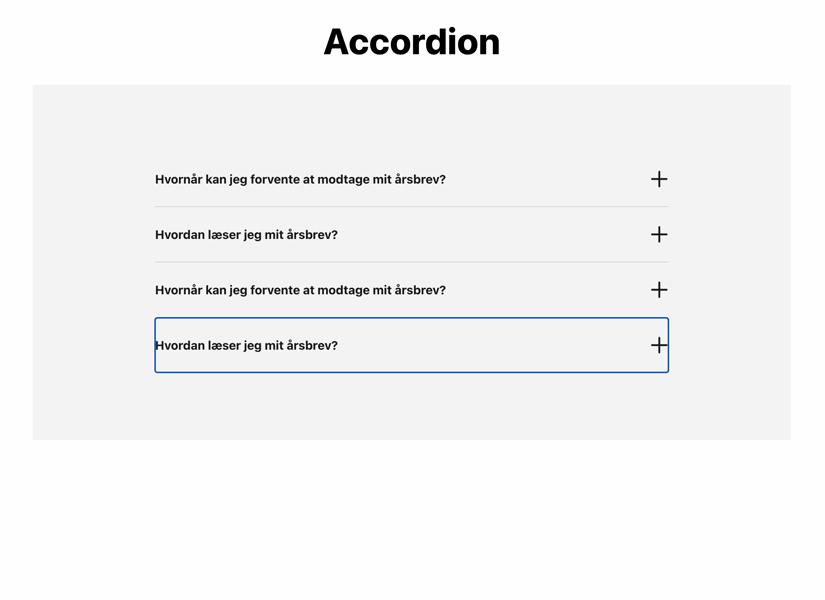

# **Animated Accordion med Details/Summary**



## Formål

Formålet med denne øvelse er at undersøge, hvordan du vil implementere en effekt ved at konsultere eksterne ressourcer. Øvelsen vil hjælpe dig med at udfordre både din forståelse af CSS og din evne til at anvende teknikker fra forskellige kilder.

## Ressourcer

Brug følgende ressourcer til at hjælpe dig med at løse denne opgave:

- [Styling details](https://developer.chrome.com/blog/styling-details)
- [Open and close transitions for the details element](https://nerdy.dev/open-and-close-transitions-for-the-details-element)
- [MDN: ::details-content](https://developer.mozilla.org/en-US/docs/Web/CSS/::details-content)

## Opgavebeskrivelse

Du skal arbejde med denne branch, som er sat op med Astro. Indholdet er allerede indlæst ind på `index.astro`, så dit fokus er primært at inkorporere effekten i `AccordionItem.astro`.

Din løsning skal tage hensyn til brugerens systempræferencer, såsom reduceret bevægelse (`prefers-reduced-motion`). Derudover skal løsningen forblive funktionel (dog uden animation) i browsere, der ikke understøtter effekten.

Du kan bruge følgende snippet til at animere ikonet, når en artikel er åben:

```css
details[open] {
  --r: z 90deg;
}
```

### Specifikke mål

- Udfordre dig selv til at anvende din viden om CSS og implementere teknikker fra eksterne ressourcer.

> [!NOTE]  
> **Bemærk, at denne branch allerede inkluderer et CSS Reset.**
